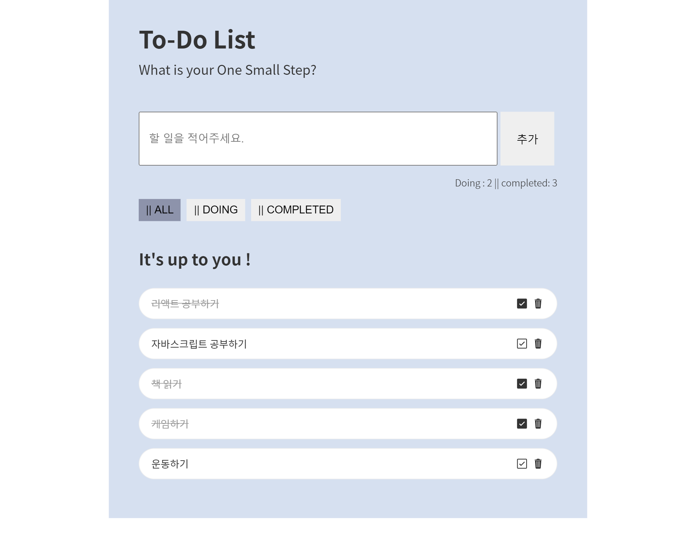

# Todo APP

## 리액트를 이용한 할 일 웹 어플리케이션

#### 링크: [TODO APP](https://jjjjhjjjj.github.io/Todo-App/)

#### 기능

    - 추가, 삭제, 상태 변환 기능 구현
    - 리스트 할 일 카운트
    - 상태별로 리스트 구분
    - useReducer, ContextAPI를 이용한 상태 관리

#### [DEMO LINK](https://michelle-todo.herokuapp.com/)
